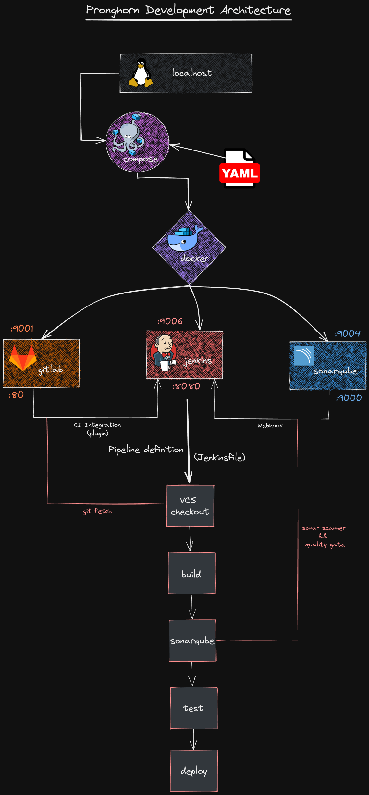

[//]: # (Title of the project)


# Pronghorn: A fast and simple CI/CD pipeline

[//]: # (GPLv3 License indicator)

[](https://www.gnu.org/licenses/gpl-3.0.html)

[//]: # (README Body)

A fast, simple, efficient and automated CI/CD pipeline.

## Table of Contents

- [Building](#building)
- [CI/CD Pipeline Proposal](#cicd-pipeline-proposal)
  - [Git](#git)
  - [GitLab CI]()
  - [Argo CD]()
  - [Kubernetes]()
- [Infrastructure Provisioning](#infrastructure-provisioning)
  - [Development Architecture](#development-architecture)
  - [Production-ready Architecture](#production-ready-architecture)

## Building

```shell
make help
```
For more information, please check the full [INSTALL](./INSTALL) guide.

## CI/CD Pipeline Proposal

(...)

### Git

## Infrastructure Provisioning

(...)

### Development Architecture

<p float="left">
  
   
</p>

(...)



### Production-ready Architecture


(...)
